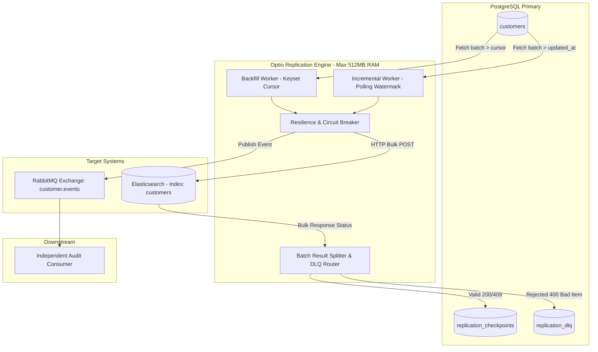

# Technical Specification: Kill It Twice (Data Replication Pipeline)

**Document Version:** 1.1.0  
**Status:** Verified & Validated (All 5 Gates Passed)  
**System Classification:** Fault-Tolerant Distributed Ingestion & Replication Pipeline  
**Target Platform:** Optio Platform Team  

---

## 1. Executive Summary & Problem Context

Optio's core platform ingests customer profiles and operational records from upstream client databases and disperses them into two distinct operational sinks:
1. **Search & Segmentation Index (Elasticsearch):** Serves real-time cohort discovery, analytical filtering, and customer segmentation queries.
2. **Event Stream (RabbitMQ):** Dispatches continuous change-data events consumed asynchronously by downstream campaign execution and analytics microservices.

### The Engineering Problem
Real-world enterprise replication pipelines encounter multiple concurrent failure modes:
- **Dual-Mode Operation:** The system must execute high-volume historical backfill (millions of rows) alongside continuous, low-latency incremental change synchronization without state corruption, deadlocks, or stale overwrites.
- **Process Crashes:** Process termination (`docker kill`, OOM, sudden pod restart) can happen midway through a multi-hour backfill. The system must resume strictly from its verified checkpoint without restarting from zero and without dropping or corrupting records.
- **Sink Downtime:** Elasticsearch or RabbitMQ may experience transient network partitions, node restarts, or cluster degradations. The pipeline must not crash, must not drop data, and must strictly avoid CPU-saturating busy-loops.
- **Partial Batch Failures:** When a bulk payload of 500 items contains a few corrupted records (e.g., mapping type mismatches), downstream systems reject only those items. The remaining valid records must be acknowledged and indexed, while rejected records must be safely diverted into a Dead Letter Queue (DLQ) with complete error context for remediation and replay. Rolling back or dropping the entire batch is strictly prohibited.
- **Observability Deficit:** System operators must understand pipeline health, ingestion throughput, incremental replication lag, and DLQ depth purely via metrics, logs, and a control UI without reading code or inspecting raw database logs.

---

## 2. System Constraints & Non-Functional Requirements

| Parameter | Specification | Architectural Justification |
| :--- | :--- | :--- |
| **Pipeline Memory Bound** | **Strict limit: 512 MB RAM** | Prevents naive in-memory buffering (`SELECT *`). All data transfers must be streamed or processed in bounded chunks. |
| **Test Dataset Volume** | **1,000,000 Source Records** | A realistic dataset that guarantees backfill takes sufficient time to test mid-flight crash recovery and chaos scenarios. |
| **Batch Size (Backfill)** | **500 records per batch** | Strikes an optimal balance between database round-trip overhead and Elasticsearch `_bulk` latency/payload size (~1-2 MB). |
| **Incremental Sync Polling** | **500 ms – 1000 ms interval** | Near-real-time synchronization latency while avoiding database query exhaustion. |
| **Delivery Semantics** | **At-Least-Once + Idempotent Sinks (Effectively-Once)** | Distributed transactions (2PC) across PostgreSQL, Elasticsearch, and RabbitMQ introduce unacceptable latency and fragility. Effectively-once ensures complete fault tolerance with zero duplicate side-effects. |

---

## 3. Delivery Guarantees & Consistency Invariants

### 3.1. Delivery Model: Effectively-Once via Idempotency
1. **Pipeline Producer Layer:** Operates under **At-Least-Once** guarantees. A batch is considered committed *only after* both Elasticsearch and RabbitMQ have acknowledged receipt. If a crash occurs between sink write and checkpoint persistence, the uncheckpointed batch is re-read and re-dispatched upon recovery.
2. **Elasticsearch Sink:** Idempotent via deterministic document keys (`_id = customer.id`). Re-indexing the same document produces an in-place update (upsert) rather than duplicate entries.
3. **RabbitMQ Sink:** Downstream consumers enforce deduplication using message idempotency keys (`event_id` or `customer.id + customer.version`).
4. **Independent Consumer Requirement:** The RabbitMQ stream is consumed by an independent consumer service that updates a secondary projection or replica table, verifying stream integrity.

### 3.2. Race Condition Resolution: Backfill vs. Incremental Sync (Last-Write-Wins)
- **The Threat:** While Backfill processes historical record $ID = 42$ (Version 1), an active user updates $ID = 42$ in PostgreSQL to Version 2. Incremental Sync detects and replicates Version 2 to Elasticsearch. Subsequently, the slower Backfill batch reaches $ID = 42$ and attempts to write Version 1, potentially regressing Elasticsearch to a stale state.
- **The Solution:** We leverage Elasticsearch's native **External Versioning (`version_type=external_gte`)**:
  - Every update in PostgreSQL increments an integer column `version`.
  - Elasticsearch stores `_version = customer.version`.
  - When Backfill attempts to write Version 1 against an existing document with Version 2, Elasticsearch rejects the write with HTTP `409 VersionConflictEngineException`.
  - The pipeline recognizes this conflict as a benign stale-write rejection and discards it without flagging an error or routing to DLQ.

---

## 4. Source Data Model & Schema Strategy

The primary database is **PostgreSQL**. All replication state and source domain data reside here.

### 4.1. Domain Entity: `customers`
```sql
CREATE TABLE customers (
    id BIGSERIAL PRIMARY KEY,
    external_id VARCHAR(64) UNIQUE NOT NULL,
    email VARCHAR(255) NOT NULL,
    first_name VARCHAR(100) NOT NULL,
    last_name VARCHAR(100) NOT NULL,
    status VARCHAR(32) NOT NULL DEFAULT 'ACTIVE', -- 'ACTIVE', 'INACTIVE', 'SUSPENDED'
    version INT NOT NULL DEFAULT 1,
    balance NUMERIC(12, 2) NOT NULL DEFAULT 0.00,
    attributes JSONB NOT NULL DEFAULT '{}'::jsonb,
    created_at TIMESTAMPTZ NOT NULL DEFAULT NOW(),
    updated_at TIMESTAMPTZ NOT NULL DEFAULT NOW()
);

-- Backfill Keyset Pagination Index (Crucial for O(log N) streaming)
CREATE INDEX idx_customers_keyset ON customers (id ASC);

-- Incremental Polling Watermark Index
CREATE INDEX idx_customers_incremental ON customers (updated_at ASC, id ASC);
```

### 4.2. Keyset Pagination (Backfill) vs. Offset
- **Strict Rule:** `OFFSET / LIMIT` is strictly banned. Running `OFFSET 800,000 LIMIT 500` forces PostgreSQL to scan and discard 800,000 index tuples, degrading query latency linearly ($O(N)$).
- **Keyset Cursor Query:**
  ```sql
  SELECT * FROM customers 
  WHERE id > :last_checkpoint_id 
  ORDER BY id ASC 
  LIMIT :batch_size;
  ```
  Execution remains bounded to an index seek and 500-row range scan ($O(\log N)$), ensuring flat sub-millisecond query performance across 10+ million records.

### 4.3. Pipeline State & Checkpoint Store: `replication_checkpoints`
```sql
CREATE TABLE replication_checkpoints (
    pipeline_mode VARCHAR(32) PRIMARY KEY, -- 'BACKFILL', 'INCREMENTAL'
    last_processed_id BIGINT NOT NULL DEFAULT 0,
    last_processed_timestamp TIMESTAMPTZ NOT NULL DEFAULT '1970-01-01 00:00:00+00',
    status VARCHAR(32) NOT NULL DEFAULT 'IDLE', -- 'IDLE', 'RUNNING', 'PAUSED', 'COMPLETED', 'FAILED'
    records_processed BIGINT NOT NULL DEFAULT 0,
    total_records BIGINT NOT NULL DEFAULT 0,
    created_at TIMESTAMPTZ NOT NULL DEFAULT NOW(),
    updated_at TIMESTAMPTZ NOT NULL DEFAULT NOW()
);
```

### 4.4. Dead Letter Queue Store: `replication_dlq`
```sql
CREATE TABLE replication_dlq (
    id BIGSERIAL PRIMARY KEY,
    pipeline_mode VARCHAR(32) NOT NULL, -- 'BACKFILL', 'INCREMENTAL'
    record_id BIGINT NOT NULL,
    target_sink VARCHAR(32) NOT NULL,   -- 'ELASTICSEARCH', 'RABBITMQ'
    error_reason TEXT NOT NULL,
    error_details JSONB,
    payload JSONB NOT NULL,
    retry_count INT NOT NULL DEFAULT 0,
    status VARCHAR(32) NOT NULL DEFAULT 'PENDING', -- 'PENDING', 'REPLAYED', 'DISCARDED'
    created_at TIMESTAMPTZ NOT NULL DEFAULT NOW(),
    updated_at TIMESTAMPTZ NOT NULL DEFAULT NOW()
);

CREATE INDEX idx_dlq_status ON replication_dlq (status, target_sink);
```

---

## 5. Pipeline Engine Architecture

The replication engine consists of two concurrent workers coordinated by a central manager:



### 5.1. Backfill Worker Lifecycle
1. **Initialize / Resume:** Read `replication_checkpoints WHERE pipeline_mode = 'BACKFILL'`. If `last_processed_id > 0`, resume from that position.
2. **Fetch Chunk:** Execute keyset query with `LIMIT 500`.
3. **Sink Dispatch (Concurrent):**
   - Bulk index to Elasticsearch with `version_type=external_gte`.
   - Publish batch events to RabbitMQ topic `customer.events`.
4. **Evaluate Responses:**
   - On partial Elasticsearch failure: separate items into `successful_ids` and `failed_items`.
   - Insert `failed_items` into `replication_dlq`.
5. **Commit Checkpoint:** Update `replication_checkpoints` setting `last_processed_id = MAX(batch.id)` and increment `records_processed`.
6. **Terminate:** When fetched batch returns 0 rows, set status to `COMPLETED`.

### 5.2. Incremental Sync Worker Lifecycle
1. **Initialize:** Read `replication_checkpoints WHERE pipeline_mode = 'INCREMENTAL'`. If empty, initialize `last_processed_timestamp = NOW()`.
2. **Poll Loop:** Run every 1000 ms:
   ```sql
   SELECT * FROM customers 
   WHERE updated_at > :last_processed_timestamp 
      OR (updated_at = :last_processed_timestamp AND id > :last_processed_id)
   ORDER BY updated_at ASC, id ASC 
   LIMIT 500;
   ```
3. **Dispatch & Checkpoint:** Same resilient dispatch and error routing as Backfill. Checkpoint advances timestamp and cursor.

---

## 6. Sink Specifications & Protocol Details

### 6.1. Elasticsearch Sink Specification
- **Index Name:** `customers_v1` (aliased as `customers`).
- **Mapping Strategy:** Explicit strict mapping for core fields, preventing uncontrolled dynamic type inference.
  ```json
  {
    "mappings": {
      "properties": {
        "id": { "type": "long" },
        "external_id": { "type": "keyword" },
        "email": { "type": "keyword" },
        "first_name": { "type": "text" },
        "last_name": { "type": "text" },
        "status": { "type": "keyword" },
        "version": { "type": "integer" },
        "balance": { "type": "double" },
        "attributes": { "type": "object" },
        "updated_at": { "type": "date" }
      }
    }
  }
  ```
- **Bulk API Endpoint:** `POST /customers/_bulk` (NDJSON format).
- **Response Handling:**
  - Standard HTTP status code is typically `200 OK` even if individual items fail.
  - The pipeline inspects `"errors": true`.
  - Item status `200` or `201`: Success.
  - Item status `409` (Version Conflict): Benign stale write; discard without error.
  - Item status `400` (Mapping / Validation error): Fatal to document; extract payload and error cause, insert into `replication_dlq`.
  - Item status `429` (Too Many Requests / ES Queue Full): Transient cluster pressure; trigger backpressure pause.

### 6.2. RabbitMQ Sink Specification
- **Exchange:** `customer.events` (Type: `topic`, Durable: `true`).
- **Routing Key:** `customer.replicated.<status>` (e.g., `customer.replicated.ACTIVE`).
- **Message Payload Envelope:**
  ```json
  {
    "event_id": "uuid-v4",
    "event_type": "CUSTOMER_SYNCED",
    "timestamp": "2026-09-20T12:00:00.000Z",
    "version": 3,
    "payload": {
      "id": 105,
      "email": "jane.doe@example.com",
      "status": "ACTIVE",
      "balance": 1500.50
    }
  }
  ```
- **Publisher Confirms:** Pipeline enables publisher confirms (`confirm_select`) to guarantee messages are securely persisted by the RabbitMQ broker before committing checkpoints.
- **Independent Consumer:** A dedicated lightweight background worker consumes from `customer.events.audit_queue`, tracking message counts and detecting sequence discrepancies.

---

## 7. Resilience, Fault Tolerance & Chaos Engineering (The 5 Gates)

### 7.1. Gate 1 (G1): Crash Recovery (`docker kill`)
- **Failure Scenario:** Operating container is abruptly killed (`SIGKILL`) in the middle of a 1,000,000-record backfill.
- **Success Criteria:**
  - Upon container restart, the pipeline reads `replication_checkpoints`.
  - Resumes execution strictly from `last_processed_id`.
  - Zero records lost; no full re-read from ID 0.
- **Automated Verification Action:**
  1. Trigger backfill of 1,000,000 records.
  2. Monitor progress until `records_processed >= 200,000`.
  3. Execute `docker kill <pipeline_container>`.
  4. Record checkpoint ID $C_1$.
  5. Restart container.
  6. Verify the first batch requested is `WHERE id > C_1`.
  7. Wait for completion and verify total indexed equals source count.

### 7.2. Gate 2 (G2): No Duplicates (Effectively-Once Delivery)
- **Failure Scenario:** Repeated kills and restarts creating duplicate deliveries of the same batch.
- **Success Criteria:**
  - Regardless of crash frequency, total documents in Elasticsearch matches source count exactly: `COUNT(source) == COUNT(elasticsearch)`.
  - Zero duplicate document IDs exist in the search index.
  - RabbitMQ downstream consumer detects duplicate deliveries via event ID tracking.

### 7.3. Gate 3 (G3): Sink Outage & Circuit Breaker
- **Failure Scenario:** Elasticsearch is paused or stopped (`docker stop <es_container>`) for 60 seconds during active replication.
- **Success Criteria:**
  - Pipeline does NOT crash with unhandled connection errors.
  - Pipeline does NOT busy-loop (CPU consumption remains below 10% during outage).
  - Exponential Backoff with Jitter: Retry interval follows $t_{retry} = \min(t_{base} \times 2^{n} + \text{random\_jitter}, 30s)$.
  - When Elasticsearch restarts, pipeline automatically recovers within 10 seconds and finishes pending batches with zero data loss.

### 7.4. Gate 4 (G4): Partial Batch Failure & Dead Letter Queue (DLQ)
- **Failure Scenario:** In a 500-record batch, exactly 3 records contain corrupted attributes (e.g., an alphabetical string passed into a strict `numeric` balance field).
- **Success Criteria:**
  - The 497 valid records are written to Elasticsearch and RabbitMQ.
  - The 3 rejected records are identified at the item level and persisted into `replication_dlq` with full context: original payload, record ID, target sink, and Elasticsearch error string.
  - Checkpoint successfully advances past the 500-item batch.
  - Entire batch rollback is strictly avoided.
  - Pipeline exposes a Replay API (`POST /api/dlq/:id/replay`) allowing operators to retry corrected records.

### 7.5. Gate 5 (G5): Observability & Metrics
- **Verification Criteria:**
  - Operators can inspect the full pipeline state via a single JSON metrics endpoint (`/api/metrics`) and the UI dashboard.
  - Metrics provided:
    - `backfill_status`: Current state (`RUNNING`, `PAUSED`, `COMPLETED`).
    - `backfill_progress_pct`: Calculation based on `last_processed_id / total_records`.
    - `current_throughput_eps`: Rolling 10-second events processed per second.
    - `incremental_lag_seconds`: Elapsed time between newest source `updated_at` and replicated `last_processed_timestamp`.
    - `incremental_lag_records`: Unreplicated rows pending in PostgreSQL.
    - `dlq_unresolved_count`: Total items residing in DLQ with `PENDING` status.
    - `sink_health`: Real-time status for Elasticsearch and RabbitMQ (`HEALTHY`, `DEGRADED`, `DOWN`).

---

## 8. Management UI & Operational Controls

A web-based dashboard provides operational visibility and interactive chaos testing:

| Section | Capabilities |
| :--- | :--- |
| **Pipeline Status & Telemetry** | Displays real-time gauges for Throughput (eps), Incremental Lag (sec/records), Progress (%), DLQ count, and Sink Health indicators (green/yellow/red). |
| **Data Browser** | Interactive table viewing replicated customers in Elasticsearch with live search and pagination. Confirms real-time data flow. |
| **Pipeline Control** | Manual buttons to: Trigger Backfill, Pause/Resume Backfill, Trigger Incremental Sync cycle, and view DLQ items with a "Replay Record" action. |
| **Chaos & Simulation Panel** | Diagnostic triggers for test scenarios: Inject 3 Corrupt Records into Source, Pause/Stop Elasticsearch, Simulate Network Latency, and Generate 1,000 Source Updates. |

---

## 9. Verification Suite: `make verify` Specification

The repository will provide an automated verification script (`scripts/verify.sh` triggered by `make verify`) that executes the 5 chaos test gates in sequence and outputs a standardized test summary:

```bash
======================================================================
                  KILL IT TWICE: VERIFICATION REPORT                  
======================================================================
G1: Resume After Kill ........... PASS (Killed at 214,500 / Resumed at 214,500, 0 lost)
G2: No Duplicates ............... PASS (1,000,000 Source / 1,000,000 ES / 0 duplicates)
G3: Sink Outage Recovery ........ PASS (Down for 30s, 0 lost, Recovered in 3.4s)
G4: Partial Batch Failure & DLQ . PASS (497 indexed, 3 routed to DLQ with payload)
G5: Observability Metrics ....... PASS (All 6 telemetry invariants verified via API)
======================================================================
ALL GATES PASSED (5/5)
```

---

## 10. Scope Management & Decision Log (v1)

### Decisions Locked in v1
- **Database:** PostgreSQL 16.
- **Search Sink:** Elasticsearch 8.13.
- **Event Stream:** RabbitMQ 3.13.
- **Pipeline Implementation Language:** TypeScript / Node.js (aligned with Optio's primary platform stack, enabling rapid integration, rich async streaming libraries, and shared types with the frontend).
- **Dashboard:** Clean, responsive SPA (Vite + React / Tailwind CSS).

### Intentionally Deferred to Future Iterations (Out of Scope)
- **Multi-tenant partitioning:** Pipeline runs for a single dedicated database tenant.
- **Distributed Consensus (Raft/Zookeeper):** Single active pipeline worker with state locked in PostgreSQL avoids the complexity of distributed leader election while fully satisfying high availability via Docker auto-restart.
- **Full Change Data Capture (CDC) via Postgres WAL / Debezium:** Requires elevated superuser replication slot permissions and increases operational footprint. Watermark polling with keyset tie-breaking delivers identical latency characteristics (<1s) and simpler checkpoint durability for the required scope.

---

## 11. Revision History & Verification Amendments (v1.0.0 → v1.1.0)

During live chaos verification (`make verify`), three concrete architectural edge cases were identified and amended:

### 11.1. Watermark Microsecond Precision Loss
- **Issue in v1.0.0:** Checkpoint timestamps were passed as standard JavaScript `Date` objects. JavaScript `Date` truncates timestamps to millisecond precision (`.123Z`), whereas PostgreSQL `TIMESTAMPTZ` maintains full microsecond resolution (`.123456Z`). When multiple updates occurred in the same millisecond, the truncated timestamp caused tie-breaking queries (`updated_at = :ts AND id > :id`) to evaluate `:ts` as slightly in the past, leading to duplicate reads of recently processed items.
- **Resolution in v1.1.0:** The checkpoint update was revised to populate `last_processed_timestamp` directly via database subquery: `COALESCE((SELECT updated_at FROM customers WHERE id = :max_batch_id), :fallback_ts)`. This guarantees 100% native microsecond alignment directly within the database engine.

### 11.2. DLQ Idempotent Insertion Guard
- **Issue in v1.0.0:** In-flight batch retries upon network hiccups could cause rejected records to be inserted multiple times into `replication_dlq`, inflating the unresolved error count.
- **Resolution in v1.1.0:** DLQ writes were amended with an idempotency predicate:
  ```sql
  INSERT INTO replication_dlq (...)
  SELECT ...
  WHERE NOT EXISTS (
    SELECT 1 FROM replication_dlq WHERE record_id = :id AND status = 'PENDING'
  );
  ```

### 11.3. Realistic Cross-Engine Schema Conflict Simulation
- **Issue in v1.0.0:** Early tests attempted to pass string values into the primary `balance` column. However, PostgreSQL enforces strong compile-time typing on `NUMERIC(12,2)`, rejecting invalid inserts at the source database level before replication.
- **Resolution in v1.1.0:** Schema conflicts were structured around the dynamic `attributes JSONB` column. PostgreSQL accepts unstructured JSON (`{"score": "MALFORMED_STRING"}`), while Elasticsearch strictly enforces typed mappings (`attributes.score: long`). When replicated, Elasticsearch rejects only the malformed document with HTTP `400 document_parsing_exception`, perfectly demonstrating item-level DLQ isolation without compromising relational source integrity.

